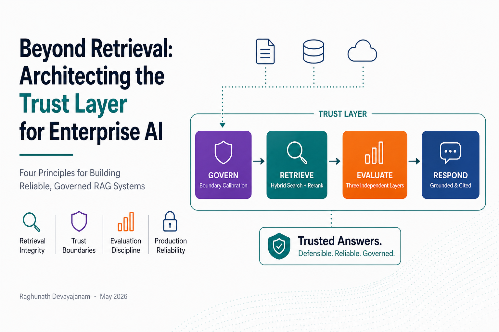
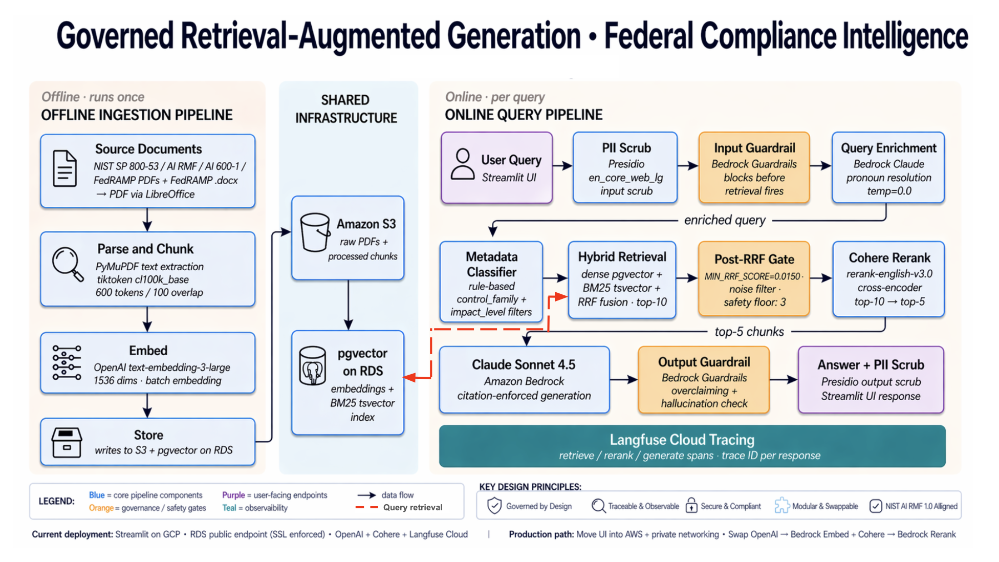
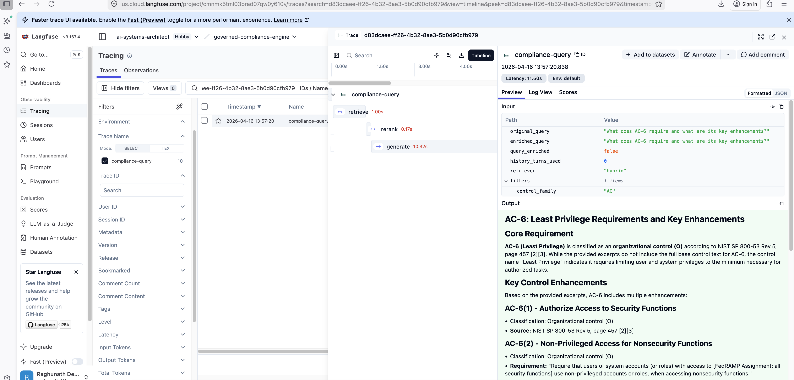
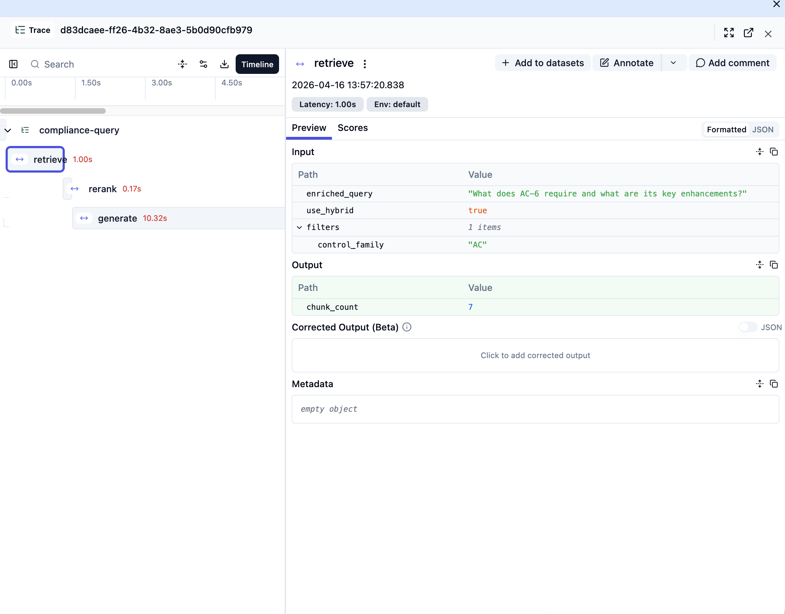
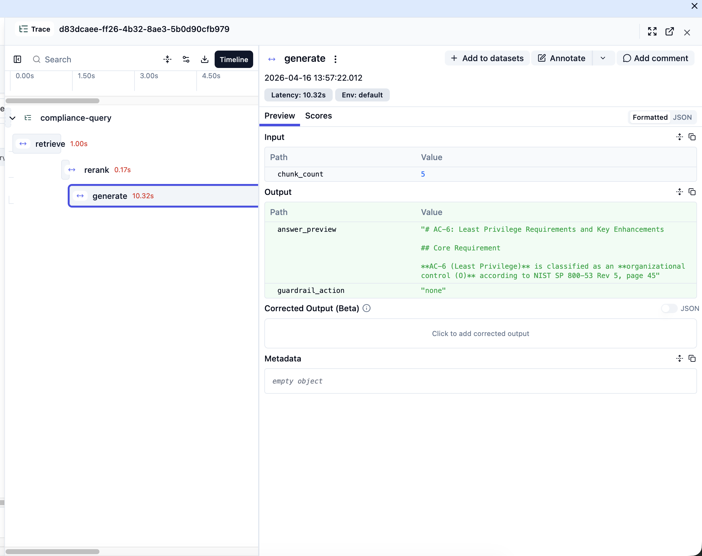

# Beyond Retrieval: Architecting the Trust Layer for Enterprise AI


Raghunath Devayajanam · May 2026



*Four principles for building reliable, governed RAG systems. [Detailed pipeline architecture below.](#pipeline)*

**Governed RAG · Federal Compliance Reference Implementation**

A production-grade, governed Retrieval-Augmented Generation system over four federal compliance frameworks — NIST SP 800-53 Rev 5, NIST AI RMF 1.0, NIST AI 600-1, and FedRAMP Moderate Baseline (1,696 chunks total). The system answers compliance questions by retrieving authoritative source content, reranking for precision, generating grounded responses via Claude Sonnet 4.5 through Amazon Bedrock, and enforcing dual guardrails against unsupported claims.

Built as a compliance *reference assistant* — not a compliance *assessment tool*. The system retrieves and synthesizes what frameworks require. It does not determine whether a system is compliant. That boundary is enforced in the system prompt and validated by Bedrock Guardrails on every response.

Implements a governed compliance RAG pattern: hybrid retrieval + dual guardrail gate + metadata-aware routing.

**What makes this distinctive:**

- **Hybrid retrieval with measurable lift** — dense pgvector HNSW + BM25 sparse via Reciprocal Rank Fusion + Cohere cross-encoder reranking. nDCG@5 progresses from 0.8883 (semantic-only) to 0.9265 (hybrid + rerank) on a 20-question architect-level evaluation set.
- **Three independent evaluation layers** — RAGAs end-to-end (Faithfulness 0.89–0.90, Context Precision 0.94–0.95 across configurations), retrieval diagnostics (Recall@k, MRR, nDCG across three configurations), and adversarial guardrail evaluation. Each layer answers a different question.
- **Dual-gate Bedrock Guardrails** — input gate (`PROMPT_ATTACK` HIGH) blocks injection and jailbreak attempts before retrieval fires, saving full pipeline cost on adversarial input. Output gate enforces contextual grounding (`GROUNDING ≥ 0.7`, `RELEVANCE ≥ 0.7`) post-generation in the same `converse()` call. Off-topic queries are handled downstream by retrieval grounding, not the input gate.
- **Domain-calibrated PII filtering** — Presidio with a 20-term federal allowlist and control-ID regex post-filter prevents false-positive scrubbing of NIST identifiers (AC-2, IR-4) and program names (FedRAMP, NIST, AWS) that general-purpose NER classifies as PERSON entities.
- **Decision log discipline** — every architectural choice documented in DL-001 through DL-029 with alternatives evaluated and rationale recorded. The architecture is auditable, not just observable.
- **Federal-grade governance artifact** — sample AI Impact Assessment maps RAG-specific risks to implemented controls following NIST AI RMF 1.0, EO 13960, and OMB M-21-06 patterns.

Designed for high-stakes, audit-sensitive environments where correctness, traceability, and controlled behavior matter more than fluency.

---

### 📄 Project artifacts

- **[AI Impact Assessment (PDF)](docs/AIIA_FCIS_v1_0.pdf)** — federal-grade governance artifact mapping RAG-specific risks (hallucination, overclaiming, retrieval integrity, PII leakage to traces) to implemented controls and evidence. Sample artifact — fictional sponsoring agency.
- **[Beyond Retrieval: Architecting the Trust Layer for Enterprise AI](ARTICLE.md)** — generalized architectural patterns this project demonstrates, drawn from production RAG governance lessons.
- **[Architecture](docs/architecture.md)** · **[Decision log](docs/decision_log.md)** · **[Evaluation methodology](docs/evaluation_methodology.md)** · **[Future enhancements](docs/future_enhancements.md)**

🔗 **Related portfolio projects**

- **[responsible-mlops-risk-engine](https://github.com/ai-systems-architect/responsible-mlops-risk-engine)** — predecessor portfolio project. Same governance discipline (NIST AI RMF 1.0, fairness audits, drift monitoring, decision-log rigor) applied to **end-to-end traditional ML** — XGBoost income risk scoring on US Census data, full lifecycle from ingestion through deployment. This project extends that discipline to **generative AI**.

---

> Independent portfolio project demonstrating production-grade governed RAG architecture for federal compliance corpora. Built on public-domain US Government frameworks. Not affiliated with or endorsed by any agency, contractor, or commercial vendor. Views are the author's own.
>
> Companion to [responsible-mlops-risk-engine](https://github.com/ai-systems-architect/responsible-mlops-risk-engine)
>
> This deployment uses a public RDS endpoint and Streamlit Community Cloud for portfolio accessibility. For regulated workloads, the production path uses private VPC, self-hosted Langfuse, and Bedrock-native embeddings — documented in [docs/architecture.md](docs/architecture.md).

---

## Why This Corpus

Federal compliance work is document-intensive and terminology-precise. A compliance
engineer asking about access control requirements needs answers grounded in the actual
control text — not model weights trained on internet data that may be outdated or
imprecise.

Four authoritative documents were selected to cover the full federal AI compliance
stack: NIST 800-53 for security controls, AI RMF for AI risk governance, AI 600-1
for GenAI-specific risk, and FedRAMP Moderate for cloud authorization requirements.
Together they represent the primary frameworks a federal AI system must navigate from
design through ATO.

| Document | Source | Chunks |
|---|---|---|
| NIST SP 800-53 Rev 5 | NIST | 1,112 |
| NIST AI RMF 1.0 | NIST | 50 |
| NIST AI 600-1 | NIST | 92 |
| FedRAMP Moderate Baseline | FedRAMP | 442 |
| **Total** | | **1,696** |

---

## Production RAG Systems — Failure Modes and Architectural Controls

Most RAG implementations stop at embed → retrieve → generate. Production systems
fail at the edges — in retrieval quality, safety, and observability. Each component
in this system exists because of a specific failure mode observed in real-world RAG
systems.

| Failure Mode | Architectural Control |
|---|---|
| Sensitive data in queries and responses | PII filtering (Presidio) at input and output |
| Prompt injection and jailbreak attempts | Bedrock Guardrails — input gate (PROMPT_ATTACK filter) before retrieval fires |
| Off-topic / out-of-scope queries | Retrieval precision — rerank scores near zero, citation-enforced system prompt declines without context |
| Ambiguous follow-up queries degrade retrieval | Query enrichment via Bedrock Claude at temp=0.0 |
| Irrelevant corpus sections retrieved | Metadata-aware filtering (control_family, impact_level) |
| Keyword queries fail semantic retrieval | Hybrid retrieval (dense + BM25 + RRF) |
| Weak candidates ranked despite low relevance | Post-RRF quality gate (MIN_RRF_SCORE=0.0150) |
| Embedding similarity lacks precision | Cohere cross-encoder reranking |
| Model overclaims beyond retrieved context | Bedrock Guardrails — output gate (contextual grounding threshold ≥ 0.7; responses below threshold blocked before reaching user) |
| No visibility into system behavior | Langfuse tracing across all pipeline stages |
| Retrieval quality not measurable | RAGAs + retrieval diagnostics (Recall@k, MRR, nDCG) |
| Model and provider lock-in risk | Embedding and generation providers swappable via environment variable |

This system is not optimized for minimal latency or simplicity. It is optimized for
correctness, auditability, and controlled behavior in high-risk environments.

---

## Architecture

| Layer | Component | Tool |
|---|---|---|
| Ingestion | PDF + Word parsing, chunking | LibreOffice headless (.docx → PDF conversion) + PyMuPDF |
| Embedding | Dense vectors (1536 dims) | OpenAI text-embedding-3-large — 1536 dims via Matryoshka truncation from 3072, retains ~99% retrieval quality, resolves pgvector HNSW 2000-dim ceiling (DL-018) |
| Vector Store | pgvector + HNSW index | RDS PostgreSQL |
| Query Classification | Rule-based metadata filter inference | Regex classifier in pipeline.py |
| Retrieval | Dense + sparse fused via RRF, metadata pre-filtered | pgvector + tsvector |
| Re-ranking | Cross-encoder re-rank | Cohere rerank-english-v3.0 |
| Tracing | Full pipeline observability | Langfuse Cloud |
| Generation | Citation-enforced prompts | Claude Sonnet 4.5 via Bedrock |
| Guardrails | Dual gates — input (PROMPT_ATTACK + MISCONDUCT) + output (contextual grounding ≥0.7, MISCONDUCT) | Bedrock Guardrails |
| Evaluation | Golden dataset scoring | RAGAs |
| Frontend | Chat UI + debug sidebar | Streamlit |
| Retrieval API | REST endpoint for agent integration | FastAPI — `src/api/main.py`, start with `./run_api.sh` |
| Infrastructure | RDS, S3, IAM | Terraform + AWS |

Full rationale for each component: [docs/decision_log.md](docs/decision_log.md)
Cloud equivalents (GCP, Azure): [docs/architecture.md](docs/architecture.md)
AI Impact Assessment (governance artifact): [docs/AIIA_FCIS_v1_0.pdf](docs/AIIA_FCIS_v1_0.pdf)

---

## Pipeline


*Full system architecture — offline ingestion, shared infrastructure, online query pipeline.*

Each stage is modular and independently replaceable. Retrieval strategies can change
without affecting generation. Models can be swapped without rewriting the pipeline.
Observability remains consistent across all components.

Dual guardrail architecture — input gate blocks before retrieval fires, output gate
prevents overclaiming after generation. A blocked input query costs one Bedrock
apply_guardrail call (~50ms). A blocked output query costs the full pipeline.

**Pipeline stages (offline ingestion + online query path):**

| # | Stage | What it does | DL |
|---|---|---|---|
| 1 | PII Scrub | Presidio en_core_web_lg scrubs query and generated output. Detected entity types: PERSON, EMAIL_ADDRESS, US_SSN, IP_ADDRESS (and others). Domain allowlist (FedRAMP, NIST, AWS, ISSO + 16 federal terms) and control ID regex prevent false-positive scrubbing of NIST identifiers. | 017 |
| 2 | Input Guardrail | Bedrock `apply_guardrail` blocks prompt injection and jailbreak attempts (PROMPT_ATTACK filter, HIGH on input) before retrieval fires — one Bedrock call cost vs full pipeline. Off-topic queries are not blocked here; they are handled downstream by retrieval grounding. | 022 |
| 3 | Query Enrichment | Bedrock Claude at `temperature=0.0` resolves pronouns and ambiguous references in follow-up queries before the embedding call. Bypassed on first turn, long queries, queries with no pronouns. | 025 |
| 4 | Classify | Rule-based metadata classifier infers `control_family` and `impact_level` filters from the enriched query. AC-family query reduces corpus from 1,696 to 424 chunks (75% reduction). | 023 |
| 5 | Ingestion (offline) | NIST 800-53, AI RMF, AI 600-1, FedRAMP Moderate parsed, chunked (600 tokens / 100 overlap), embedded via OpenAI text-embedding-3-large (1536 dims via Matryoshka), stored in pgvector on RDS with `control_family` and `impact_level` metadata columns. | 007, 018 |
| 6 | Retrieval | Hybrid dense (pgvector HNSW) + sparse (BM25 tsvector) fused via RRF. Control IDs regex pre-extracted before BM25's 5-term limit. Returns top-10 candidates. | 008, 019 |
| 7 | Post-RRF Quality Gate | `MIN_RRF_SCORE=0.0150` drops weak candidates before Cohere reranks them. Safety floor: 3 candidates always pass. Threshold derived from empirical score distribution across 7 representative queries. | 024 |
| 8 | Reranking | Cohere rerank-english-v3.0 cross-encoder scores filtered candidates jointly against the query. Returns top-5. | 005 |
| 9 | Generation + Output Guardrail | Claude Sonnet 4.5 via Bedrock `converse()` with `guardrailConfig` attached — single API call generates response and applies guardrail. Contextual grounding threshold ≥ 0.7 — responses below threshold are blocked before reaching the user (pass/fail; raw grounding score is not returned by the API). Pydantic `GenerateResponse` validates response shape before return. | 004, 022 |
| 10 | Evaluation (offline) | Three independent layers — RAGAs (Faithfulness/Context Precision/Context Recall/Answer Relevancy), retrieval diagnostics (Recall@k/MRR/nDCG across three configurations), and adversarial guardrail evaluation (5 negative cases with two-signal pass detection). | 009, 021, 028 |

Full per-stage rationale, code references, and design tradeoffs are in [docs/architecture.md](docs/architecture.md). Decision log entries (DL-001 through DL-029) cover the why behind each stage in [docs/decision_log.md](docs/decision_log.md).

---

## Retrieval Architecture — Why Hybrid

**Dense retrieval (pgvector HNSW)** embeds the query and chunks independently then
measures cosine similarity between vectors. Effective for conceptual and abstract
queries — AI RMF governance language, risk framework concepts, cross-corpus synthesis
questions.

**Sparse retrieval (tsvector BM25)** matches on vocabulary. Effective for queries
containing exact control identifiers — AC-6, IR-4, SC-28, CM-7. A compliance engineer
searching for a specific control by ID gets the right chunks surfaced immediately.

**RRF fusion (k=60)** combines both ranked lists: score = Σ 1/(60 + rank). The
constant k=60 is empirically validated across information retrieval literature — it
prevents high-ranked results from dominating while preserving rank signal.

**BM25 query preprocessing:** Long natural language questions AND-chain all terms via
plainto_tsquery, returning zero results when no single chunk contains every term
simultaneously. Preprocessing strips stop words and limits to five key terms. Control
identifiers (AC-6, IR-4) are regex-extracted from the original query before the
five-term limit applies — they always occupy the leading slots as high-value BM25
anchors. See docs/decision_log.md DL-019.

**Cohere reranking:** The cross-encoder reads query and chunk together — joint inference
via attention mechanism — producing a relevance probability rather than a geometric
distance. Runs only on the top-10 retrieved chunks, not the full corpus.

---

## Proof of Operation

Live pipeline trace — query: "What does AC-6 require and what are its key enhancements?"
Trace ID: d83dcaee-ff26-4b32-8ae3-5b0d90cfb979

The trace screenshots below verify that the architectural claims in the prior sections match the runtime behavior. The full pipeline ran end-to-end: input guardrail checked, metadata classifier inferred `control_family=AC` (424 of 1,696 chunks searched — 75% reduction), hybrid retrieval combined dense + BM25 with `sparse_query: 'AC-6 require key enhancements'`, post-RRF gate passed 7 of 11 candidates, Cohere reranked 7 → 5 (top chunk relevance score: 0.989), Claude Sonnet 4.5 generated a cited response, output guardrail action: none.

For a high-level demo: see [Worked Examples](docs/worked_examples.md) for the AC-6 query rendered as a user-facing answer with citations and retrieved chunks. The screenshots below show the underlying pipeline trace for architectural verification.

> This demo simulates a federal compliance analyst querying across
> NIST SP 800-53, AI RMF, AI 600-1, and FedRAMP Moderate — with
> PII filtering and dual guardrail enforcement active.


*Trace overview — compliance-query trace showing retrieve (1.00s), rerank (0.17s), generate (10.32s) spans. Input: original query, retriever=hybrid, filters control_family=AC. Output: full AC-6 cited answer, guardrail_action=none.*


*Retrieve span — enriched_query passed to hybrid retriever, control_family=AC filter applied, use_hybrid=true, 7 chunks returned post-RRF gate.*


*Generate span — 5 reranked chunks passed to Claude Sonnet 4.5 via Bedrock, AC-6 cited response returned, guardrail_action=none.*

Cohere returns a relevance score (0–1 cross-encoder probability) per chunk. Full RRF + rerank scoring tables for all three query types: [docs/worked_examples.md](docs/worked_examples.md).

---

## Governance Outcomes

Measured across three independent evaluation layers — RAGAs end-to-end quality, retrieval diagnostics, and adversarial guardrail evaluation — against a 20-question architect-level golden dataset covering all four corpus sources.

| Metric | Result | Signal |
|--------|--------|--------|
| Faithfulness | 0.90 | Grounded in retrieved chunks — primary correctness signal |
| Context Precision | 0.94 | Retrieved chunks are high-signal, low-noise |
| Context Recall | 0.75 | Sufficient — over-retrieval adds noise in compliance contexts |
| Answer Relevancy | 0.56 | Expected — hedged compliance assertions score low by design |
| nDCG@5 (Hybrid + Rerank) | 0.9265 | Best of three configurations; RRF + Cohere each add measurable lift |
| RRF quality gate | 0.0150 | Just above theoretical floor 1/(60+10)=0.0143 — drops single-leg tail candidates |
| Adversarial refusal rate | 5 / 5 | Corpus grounding defense — near-zero rerank scores on out-of-scope queries; hard guardrail block not triggered |

### RAGAs — End-to-End Quality

| Metric | Semantic | Hybrid |
|--------|----------|--------|
| Faithfulness | 0.90 | 0.89 |
| Answer Relevancy | 0.56 | 0.51 |
| Context Precision | 0.94 | 0.95 |
| Context Recall | 0.75 | 0.76 |

Hybrid retrieval outperforms semantic on context precision, confirming
BM25 adds signal for keyword-dominant NIST 800-53 and FedRAMP queries
containing exact control identifiers. For AI RMF and AI 600-1 governance
queries, dense retrieval is sufficient — governance language does not
produce distinctive BM25 tokens.

Answer relevancy scores lower than other metrics for two reasons: the
system prompt instructs Claude to hedge and note applicability limitations
rather than answer directly — correct behavior for federal compliance but
penalized by this metric. Additionally, architect-level multi-part
questions fragment RAGAs synthetic question comparison. Faithfulness
(0.90) and context precision (0.94) are the primary quality signals
for this use case.

> A slightly verbose but correct answer is acceptable.
> An overconfident or incorrect answer is not.

### Retrieval Diagnostics

Retrieval quality measured independently of generation — Recall@5, MRR,
and nDCG across three pipeline configurations. Ground truth labels derived
from token overlap with reference answers across a broad candidate pool.

| Query Type | R@5 Semantic | R@5 Hybrid | R@5 H+Rerank | MRR Semantic | MRR Hybrid | MRR H+Rerank |
|---|---|---|---|---|---|---|
| Control ID (n=9) | 0.1516 | 0.1558 | 0.1558 | 1.0000 | 1.0000 | 1.0000 |
| Governance (n=8) | 0.2099 | 0.2099 | 0.2197 | 0.8750 | 0.9375 | 0.9375 |
| Cross-corpus (n=3) | 0.1130 | 0.1258 | 0.1258 | 0.6667 | 0.6667 | 0.6667 |
| **Average (n=20)** | **0.1691** | **0.1729** | **0.1768** | **0.9000** | **0.9250** | **0.9250** |

nDCG@5 — Semantic: 0.8883 | Hybrid: 0.9092 | Hybrid+Rerank: 0.9265

The most relevant chunk surfaces at rank 1 for 90%+ of questions (MRR 0.90+).
Recall@5 appears low (0.17) because the ground truth pool averages 28 chunks
per question — top-5 retrieval capturing 17% of 28 labeled chunks reflects the
large denominator, not a retrieval failure. nDCG@5 progression (0.8883 → 0.9092
→ 0.927) confirms each pipeline layer adds ranking quality: RRF fusion improves
governance query ranking (MRR 0.875 → 0.938), Cohere cross-encoder refines
mid-list precision without displacing already-correct top-1 positions (MRR
unchanged at Hybrid → H+Rerank, nDCG +0.018). Control ID queries achieve
perfect MRR 1.00 across all configurations — exact control identifiers anchor
both dense and BM25 retrieval reliably.

See [docs/evaluation_methodology.md](docs/evaluation_methodology.md) for full metric definitions, formulas, and signal selection rationale.

---

## Worked Examples

Three representative queries run end-to-end against the live pipeline (Control ID lookup, AI governance synthesis, Cross-corpus synthesis), plus three negative test cases probing out-of-scope refusal behavior. Each example includes the retrieval trace, rerank scores, generated answer with citation spot-check, and pipeline metadata.

→ See [docs/worked_examples.md](docs/worked_examples.md) for full traces, scoring tables, citation spot-checks, and findings.

The examples correspond to the three query type categories in the 20-question golden dataset described in [docs/evaluation_methodology.md](docs/evaluation_methodology.md).

---

## Key Architectural Tradeoffs

| Decision | Chosen | Rejected | Tradeoff |
|---|---|---|---|
| Vector store | pgvector on RDS | Pinecone, Weaviate, Qdrant | Single AWS security boundary over managed convenience — one IAM policy, one audit trail |
| Retrieval | Hybrid dense + BM25 + RRF | Dense-only | Control IDs (AC-6, IR-4) need exact token matching — semantic alone misses them at rank 1 |
| Reranking | Cohere cross-encoder | Bi-encoder similarity | Joint query+chunk inference produces trained relevance judgment, not geometric distance |
| Embedding dims | 1536 (Matryoshka truncation) | 3072 full dims | pgvector HNSW 2000-dim ceiling — retains ~99% retrieval quality at half the dimensions |
| Generation | Claude Sonnet 4.5 via Bedrock | Direct Anthropic API | Bedrock keeps generation within AWS boundary — direct API sends chunks to external endpoint |
| Guardrails | Dual gates input + output | Output-only | Input gate stops prompt injection before retrieval fires — one Bedrock call vs full pipeline cost |

Full rationale with alternatives evaluated in docs/decision_log.md (DL-001 through DL-029).

---

## Known Limitations and Failure Analysis

| # | Failure type | Affected queries | Root cause | Status |
|---|---|---|---|---|
| 1 | BM25 sparse=0 on governance queries | AI RMF, AI 600-1 | Governance language (govern, measure, trustworthy) does not survive stop word stripping as distinctive BM25 tokens | By design — dense-only fallback is correct for abstract language |
| 2 | Control ID truncation by 5-term BM25 limit | Any query with control ID after position 5 | `_sparse_query()` strips stop words and limits to 5 terms — AC-2 or IR-4 appearing late in query dropped | Fixed in DL-019 — regex pre-extraction implemented |
| 3 | Answer relevancy below 0.70 target | All queries | System prompt compliance hedging penalized by RAGAs which rewards concise direct answers | Accepted — fixing requires weakening safety behavior |
| 4 | RAGAs multi-part question fragmentation | Architect-level multi-part questions | RAGAs synthetic question generation partially overlaps original questions | Evaluation set limitation — documented in DL-020 |

Failures 1 and 3 are accepted tradeoffs. Failure 2 is resolved. Failure 4 is an evaluation methodology artifact that does not affect production system quality.

---

## Security & Compliance Posture

### NIST AI RMF Alignment

| Function | Implementation |
|---|---|
| GOVERN | System prompt enforces compliance reference boundary — no compliance determinations, output grounded in retrieved context, Bedrock Guardrails enforcement, decision log documents all architectural choices (DL-001 through DL-029) |
| MAP | Corpus scope explicitly bounded to four frameworks, system capability ceiling documented in README, PII surfaces identified across input / corpus / output / traces |
| MEASURE | RAGAs evaluation against 20-question golden dataset, semantic vs hybrid quantified comparison, Langfuse latency and span tracing per pipeline stage |
| MANAGE | Guardrails block compliance determination responses, provider abstraction enables model swap without pipeline rewrite |

### OWASP LLM Top 10 Alignment

[OWASP LLM Top 10](https://owasp.org/www-project-top-10-for-large-language-model-applications/) is the industry-standard taxonomy of security risks in LLM-based applications.

| Risk | How this system addresses it |
|---|---|
| LLM01 — Prompt Injection | Input guardrail (`PROMPT_ATTACK` HIGH) blocks injection before retrieval fires. Static trusted corpus — retrieved chunks cannot carry injected instructions. |
| LLM02 — Sensitive Information Disclosure | Presidio PII scrub at input and output (PERSON, EMAIL_ADDRESS, US_SSN, IP_ADDRESS). Corpus is public federal documents — no sensitive data at rest. |
| LLM04 — Data and Model Poisoning | Corpus is static, read-only, sourced from official NIST/CSRC and FedRAMP URLs — no user-contributed content, no write path to the vector store. |
| LLM05 — Improper Output Handling | Pydantic `GenerateResponse` validates every response shape before leaving `generate()`. Presidio scrubs the generated answer before it reaches the caller. |
| LLM06 — Excessive Agency | RAG-only system — no tool execution, no memory writes, no external API calls triggered by the model. Agency is zero by design. |
| LLM08 — Vector / Embedding Weaknesses | Static corpus eliminates poisoning risk. Metadata filters restrict retrieval scope. All embeddings within the AWS boundary (RDS pgvector — no third-party vector store). |
| LLM09 — Misinformation / Hallucination | Contextual grounding threshold ≥ 0.7 blocks responses not supported by retrieved chunks (pass/fail — raw score not returned by API). Faithfulness 0.89–0.90 on 20-question golden dataset. Citation enforcement in system prompt. |

Partially addressed: **LLM03** (Supply Chain) — OpenAI, Cohere, Langfuse dependencies documented in [Deployment Boundary](#deployment-boundary); no SBOM or automated dependency scanning beyond `requirements.txt`. **LLM07** (System Prompt Leakage) — system prompt is a 7-line citation-boundary instruction with no embedded credentials or sensitive logic. **LLM10** (Unbounded Consumption) — input gate short-circuits full pipeline cost on adversarial queries; no explicit rate limiting at portfolio scale.

---

## Deployment Boundary

Corpus and vector store remain within AWS (RDS + S3). Generation occurs via Amazon
Bedrock (Claude Sonnet 4.5). External services used:

- **OpenAI** — query embedding (text-embedding-3-large)
- **Cohere** — reranking (rerank-english-v3.0)
- **Langfuse Cloud** — pipeline tracing (us.cloud.langfuse.com)

A fully AWS-bound variant using Bedrock-native embeddings, Bedrock rerank, and
self-hosted Langfuse is documented in [docs/architecture.md](docs/architecture.md).

---

## Future Work

Implemented items removed — see docs/decision_log.md for closed decisions (DL-001 through DL-029).

### Production Required

**Presidio production path** — PII filtering is implemented at query input and generated
output; Langfuse traces receive pre-scrubbed content. Corpus ingestion scrubbing hook
exists in `utils/pii_filter.py` but is not wired into the ingestion pipeline — deferred
because the current corpus (public NIST documents) contains no PII. Required when corpus
expands to SSPs or assessment reports. AWS Comprehend is the recommended managed
replacement for Presidio in a full production AWS deployment. See docs/decision_log.md DL-017.

**RAG-RBAC role-based retrieval filtering** — `sensitivity_level` column in chunks table
with `WHERE sensitivity_level <= user_clearance` pre-filter. Foundation already exists in
the metadata filtering layer (DL-023). Required when corpus includes controlled or
sensitivity-tiered documents.

### Stretch

**Evaluation depth — entity-level recall and citation verification** — two complementary
additions to the current evaluation framework. *Context entities recall:* RAGAs metric that
checks whether specific identifiers from the reference answer (AC-2, MAP-1.1) appear inside
retrieved chunk text. Complementary to Recall@k — Recall@k confirms the right chunk IDs
were retrieved, entity recall confirms those chunks actually contain the control
identifiers the answer needs. *Citation precision automation:* citations are enforced at
generation time; automation cross-references each generated citation against source PDF
section/page to catch cases where the model cites a plausible but incorrect section.
Currently spot-checked manually per worked example; automation scales verification to all
20 golden dataset questions.

**System-specific compliance assistant** — per-session intake of system impact level,
deployment model, and data types to condition retrieval; structured checklist generation as
a second LLM call post-retrieval to produce system-specific control checklists rather than
prose; cross-session profile persistence in RDS keyed by user ID. Three phases of one
capability — moves the system from general corpus lookup toward target-system control
applicability. Within-session memory already implemented via DL-025.

**Structured intent extraction** — classify query intent (control lookup, gap assessment,
cross-framework synthesis) before retrieval. Route to appropriate retriever config per
intent — control ID lookup favors BM25 (evidence in retrieval diagnostics by query type);
other intents may benefit from different retriever configurations, to be validated empirically.

**True AWS-boundary variant** — replace OpenAI embeddings with Amazon Titan or Cohere
Embed via Bedrock to keep all data within the AWS boundary at ingestion time.

**Query expansion / multi-query rewriting** — HyDE or LLM-generated query variants to
broaden retrieval on abstract governance queries where vocabulary mismatch causes semantic
drift.

### Considered and Deferred

**Self-correction loop** — re-attempt retrieval with broader search radius when faithfulness
scores fall below threshold. Evaluated and deferred for this system: the dual-guardrail
design provides the safety floor, and the re-attempt pattern is more appropriate for
production agentic systems where retrieval-time decisions feed into multi-step workflows.
Reconsider when this codebase extends to agentic patterns.

---

## System Dependencies

LibreOffice is required for FedRAMP document conversion:

```bash
# Mac
brew install libreoffice

# Ubuntu / EC2
sudo apt-get install libreoffice
```

---

## Setup

```bash
git clone https://github.com/ai-systems-architect/trust-layer-rag.git
cd trust-layer-rag
python -m venv venv
source venv/bin/activate
pip install -r requirements.txt
cp .env.example .env
# fill in .env with your credentials
export PYTHONPATH=.
```

**To start the retrieval API** (for trust-layer-agent integration):

```bash
./run_api.sh
# API available at http://localhost:8000
# Docs at http://localhost:8000/docs
```

**Requirements:**
- Python 3.9+
- LibreOffice (FedRAMP .docx → PDF conversion)
- AWS CLI configured with Bedrock access
- OpenAI API key
- Cohere API key
- Langfuse account (Cloud — us.cloud.langfuse.com)
- PostgreSQL RDS instance with pgvector extension (provisioned via Terraform in Step 1)

---

## RAGAs Score Progression

| Pipeline Stage | Faithfulness | Context Precision | Context Recall | Answer Relevancy |
|---|---|---|---|---|
| Dense-only (semantic) baseline | 0.90 | 0.94 | 0.75 | 0.56 |
| Hybrid retrieval (RRF + BM25) | 0.89 | 0.95 | 0.76 | 0.51 |

---

## Pipeline Latency and Cost Per Query

| Stage | Typical Latency | Notes |
|---|---|---|
| PII scrub (input) | ~5–15ms | Presidio en_core_web_lg, local |
| Input guardrail | ~100–300ms | Bedrock Guardrails |
| Query enrichment | ~100–250ms | Bedrock Claude, only when triggered |
| Embed query | ~50–100ms | OpenAI API |
| Dense retrieval | ~20–50ms | pgvector HNSW |
| Sparse retrieval | ~10–30ms | PostgreSQL tsvector |
| Rerank | ~150–300ms | Cohere API |
| Generation (incl. output guardrail) | ~7000–12000ms | Bedrock Claude Sonnet 4.5 with guardrailConfig — multi-paragraph cited responses dominate |
| PII scrub (output) | ~5–15ms | Presidio, local |
| **Total end-to-end** | **~8–13s** | Generation is ~90% of total — see Worked Examples for measured values |

| Component | Cost Per Query |
|---|---|
| OpenAI embedding | ~$0.00013 |
| Cohere rerank | ~$0.001 |
| Bedrock Claude Sonnet 4.5 | ~$0.005–0.025 (varies by output length) |
| Bedrock Guardrails — input gate (`apply_guardrail`) | ~$0.0008 |
| Bedrock Guardrails — output gate | included in `converse()` — no separate charge |
| Query enrichment (Claude Sonnet 4.5, when triggered) | ~$0.0006 avg (est. 40% trigger rate × ~$0.0015/call) |
| **Approximate total** | **~$0.008–0.028** |

**Blocked queries** cost the input guardrail call only (~$0.0008) — no embedding, retrieval, rerank, or generation cost when the input gate intervenes.

Langfuse traces confirm these ranges. Generation dominates at ~90% of total query time — a multi-paragraph cited compliance response through `converse()` with `guardrailConfig` attached is doing more work than a typical chat response: five reranked chunks passed as context, citation-enforced system prompt, and guardrail evaluation in the same call.

This is expected and acceptable. This system is optimized for correctness, grounding, and auditability — not minimal latency. That tradeoff is stated explicitly in the [opening section of this README](#production-rag-systems--failure-modes-and-architectural-controls). For a compliance reference assistant where a wrong answer has real consequences, 8–13s for a grounded, cited, guardrail-checked response is the right operating point.

---

## Cost

### Current portfolio deployment

| Component | Cost |
|---|---|
| One-time ingestion (OpenAI embeddings) | ~$0.07 |
| Development (RDS + Bedrock + Cohere) | ~$15–30 total |
| Live demo (RDS t3.micro + Bedrock per query) | ~$17–20/month |
| Langfuse, Streamlit Community Cloud | $0 |

RDS is provisioned on demand — tear down when not actively building (~$2/day active).

### Cost at production scale

Per-query cost (~$0.008–0.028) is volume-linear. RDS scales as a separate fixed-cost dimension. Approximate monthly costs:

| Volume | Per-query (avg) | Variable (queries) | Fixed (RDS) | Approximate total |
|---|---|---|---|---|
| Portfolio demo (~50/month) | ~$0.018 | ~$0.90 | ~$13 | ~$17–20 |
| Light production (~1K/month) | ~$0.018 | ~$18 | ~$13 | ~$30–35 |
| Steady production (~10K/month) | ~$0.018 | ~$180 | ~$50 (db.t3.small) | ~$230 |
| High-volume (~100K/month) | ~$0.012 (intent routing) | ~$1,200 | ~$200 (db.r6g.large) | ~$1,400 |

**Assumptions.** Production-tier RDS estimates assume Multi-AZ deployment for SLA reliability — halve for single-AZ dev/staging. The high-volume per-query figure assumes ~50% of queries are control-ID lookups routable to Claude Haiku via intent classification (see lever 1 below).

**Excluded from totals above.** Production deployment beyond the portfolio tier adds:
- **NAT Gateway** (~$33/month + data transfer) — required when Streamlit moves into a private VPC per the architecture migration path
- **Langfuse Cloud beyond free tier** (~$50/month at 10K queries/month volume) — or self-hosted Langfuse on the same VPC at compute cost only
- **VPC endpoints for Bedrock and S3** (~$15/month per endpoint) — eliminates NAT charges for AWS-internal traffic

See [Network Architecture](docs/architecture.md#network-architecture) for the full production topology.

### Cost optimization levers at scale

Two levers in order of impact when per-query cost matters:

1. **Intent routing to Claude Haiku** for simpler queries. Control-ID lookups don't need Sonnet; a lightweight classifier ahead of generation routes them to Haiku at ~$0.001/query vs Sonnet's $0.005–0.025. At a ~50% Haiku / ~50% Sonnet split, the routed subset drops ~80%+ per query and overall generation cost drops ~30%.

2. **Batch inference for non-realtime workloads.** Bedrock batch inference is ~50% discount. Useful for re-ingestion, evaluation runs, or any workflow that doesn't need realtime response — does not apply to user-facing chat queries.

Vector store migration (pgvector → Qdrant) is triggered by corpus size or HNSW latency, not query volume — see [docs/architecture.md](docs/architecture.md#vector-store--migration-trigger). At 1M+ chunks or P99 query latency over 100ms at peak, migration becomes the right call.

---

## Further Reading

- [Project overview → raghudevayajanam.com](https://raghudevayajanam.com/work/trust-layer-rag/)
- [Companion article: Beyond Retrieval — Architecting the Trust Layer for Enterprise AI](https://raghudevayajanam.com/writing/beyond-retrieval/)

---

## License

MIT License — see [LICENSE](LICENSE.md).

Copyright (c) 2026 Raghunath Devayajanam.

This project ingests US Government public-domain compliance frameworks
(NIST 800-53, NIST AI RMF 1.0, NIST AI 600-1, FedRAMP Moderate). Those
documents are works of the US Government and are not subject to copyright
protection in the United States (17 U.S.C. § 105). They are included to
demonstrate retrieval-augmented generation over federal compliance corpora.
No US Government endorsement is implied.
