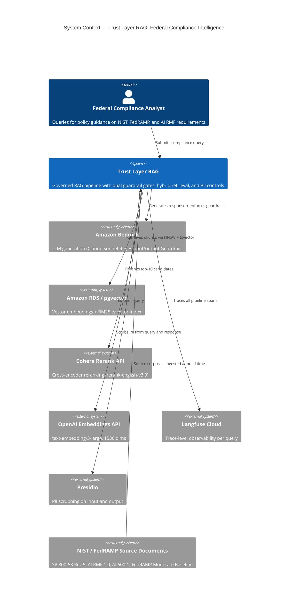

# Architecture — The Trust Layer for Enterprise AI

High-level system design. For why each component was chosen over alternatives,
see [decision_log.md](decision_log.md).

---

## C4 Context — System Context Diagram



*See [governed_rag_architecture.png](images/governed_rag_architecture.png) for full pipeline detail.*

---

## Architecture Pattern

**Pattern: Governed Compliance RAG — hybrid retrieval + dual guardrail gate + metadata-aware routing**

This system implements a governed compliance RAG pattern characterized by three decisions:

- **Hybrid retrieval** — dense pgvector HNSW + sparse BM25 fused via RRF (k=60). Captures both semantic and lexical signal across the NIST/FedRAMP corpus. Control identifiers (AC-6, IR-4) need exact token matching that semantic retrieval alone misses at rank 1.
- **Dual guardrail gate** — Bedrock Guardrails applied at input before retrieval fires and at output before the response is returned. Compliance assertions never bypass safety controls regardless of retrieval quality.
- **Metadata-aware routing** — rule-based classifier routes queries by control family and impact level before retrieval runs. Reduces candidate set noise and enforces document scope without schema changes.

---

## Overview

Governed RAG system for NIST, FISMA, and FedRAMP compliance. Ingests four
federal regulatory documents (three PDFs via PyMuPDF, FedRAMP Word document
converted to PDF via LibreOffice), stores embeddings in pgvector on RDS,
retrieves via hybrid dense + sparse fusion, re-ranks with Cohere, generates
citation-enforced responses via Claude Sonnet 4.5 on Bedrock, and enforces
hallucination controls via Bedrock Guardrails. Every pipeline call is traced
end-to-end in Langfuse Cloud.

Security posture mapped to NIST AI RMF and OWASP LLM Top 10 — see [README — Security & Compliance Posture](../README.md#security--compliance-posture).

---

## System Architecture


*System architecture overview — see ASCII pipeline diagrams below for per-stage decision log references.*

---

## Pipeline

### Ingestion (one-time)

```
NIST 800-53 / AI RMF / AI 600-1 (PDF) + FedRAMP Moderate (.docx → PDF)
        │
        ▼
   Document Ingestion
   (PyMuPDF extraction + tiktoken chunking — 600 tokens / 100 overlap)
   [production: AWS Batch job — see DL-016]
        │
        ▼
   Embedding
   (OpenAI text-embedding-3-large — 1536 dims, Matryoshka truncation)
        │
        ▼
   pgvector on RDS
   (HNSW cosine index + GIN tsvector index)
```

### Query pipeline (per request)

```
User Query
        │
        ▼
   PII Scrub — Presidio (query input)
        │
        ▼
   Input Guardrail — Bedrock Guardrails
   (PROMPT_ATTACK HIGH: injection / jailbreaks — blocked → early return, no retrieval cost)
        │
        ▼
   Query Enrichment — Bedrock Claude temp=0.0  (DL-025)
   (pronoun resolution: "that" → "AC-6"; bypass on first turn / 8+ words / no pronouns)
        │
        ▼
   Classify Query — rule-based  (DL-023)
   (infer control_family + impact_level metadata pre-filters from query text)
        │
        ▼
   Metadata-Filtered Hybrid Retrieval
   ┌──────────────┬──────────────┐
   Dense           Sparse
   (pgvector HNSW) (tsvector / BM25)
   └──────────────┴──────────────┘
        │  RRF fusion — top-10  (DL-008)
        ▼
   Post-RRF Quality Gate  (DL-024)
   (MIN_RRF_SCORE=0.0150 — drops weak candidates; safety floor: 3 candidates)
        │
        ▼
   Cohere Rerank — cross-encoder, top-10 → top-5  (DL-005)
        │
        ▼
   Claude Sonnet 4.5 via Bedrock — citation-enforced generation  (DL-004)
        │
        ▼
   Output Guardrail — Bedrock Guardrails
   (overclaiming, hallucination controls)
        │
        ▼
   PII Scrub — Presidio (generated output)  (DL-017)
        │
        ▼
   Response ──► Langfuse Trace
                (span-level: retrieve → rerank → generate)
```

### Per-Stage Implementation Detail

The diagram above shows the stage sequence. The table below captures implementation choices not visible in the diagram — bypass logic, threshold derivation, allowlist composition, validation patterns. Stages are deliberately separated: retrieval outputs ranked chunks only, no LLM is called until generation. If the right chunks are not in the top-10, nothing downstream recovers — this boundary makes retrieval validatable in isolation.

| # | Stage | Implementation detail | Files | DL |
|---|---|---|---|---|
| 1 | PII Scrub | Presidio `en_core_web_lg` scans the raw query before any external service call (OpenAI, Cohere, Langfuse, Bedrock) and replaces detected entities (PERSON, EMAIL_ADDRESS, US_SSN, IP_ADDRESS, and others) with bracketed type placeholders. A second pass runs on the generated answer before returning to the caller — catches query PII echoed in the response. A `_DOMAIN_ALLOWLIST` (FedRAMP, NIST, AWS, ISSO + 16 other federal terms — 20 total) and a control-ID regex post-filter prevent federal acronyms and NIST identifiers (AC-2, IR-4) from being misclassified as PERSON entities by the NER model. | `utils/pii_filter.py` | DL-017 |
| 2 | Input Guardrail | Bedrock Guardrails `apply_guardrail` API checks the raw query before any retrieval runs. Blocks prompt injection and jailbreak attempts via the `PROMPT_ATTACK` filter (HIGH on input) and harmful-instruction content via `MISCONDUCT` (MEDIUM). Off-topic queries are not blocked here — they reach generation and are declined by retrieval grounding (rerank scores near zero) plus the citation-enforced system prompt. Cost: one Bedrock call (~50ms, ~$0.0008) versus the full pipeline cost on adversarial queries. | — | DL-022 |
| 3 | Query Enrichment | Bedrock Claude at `temperature=0.0` rewrites pronouns and ambiguous references in follow-up queries deterministically, using recent conversation context before the embedding call. Example: "How does that relate to least privilege?" → "How does AC-6 relate to least privilege in NIST 800-53?" — the retriever embeds a fully specified query. Bypassed on first turn, long queries (8+ words), and queries with no ambiguous pronouns — adds ~150ms only on triggered queries. Rewrite visible in app UI and Langfuse trace. | `retrieval/query_enrichment.py` | DL-025 |
| 4 | Classify | Rule-based regex classifier infers metadata pre-filters from the enriched query text. Queries containing NIST 800-53 control IDs (e.g., AC-2, IR-4) resolve to a `control_family` filter; queries mentioning FedRAMP Moderate resolve to an `impact_level` filter. Runs on the enriched query so resolved control IDs trigger filters even when the original query used a pronoun. Empirical impact: AC-family query reduces corpus from 1,696 to 424 chunks (75% reduction) before HNSW search runs. | `pipeline.py` | DL-023 |
| 5 | Ingestion | NIST 800-53, AI RMF, and AI 600-1 ingest as PDFs via PyMuPDF; FedRAMP Moderate ingests as `.docx` converted to PDF via LibreOffice headless before extraction. Text chunked with tiktoken `cl100k_base` at 600 tokens / 100-token overlap, then embedded via OpenAI `text-embedding-3-large` at 1536 dims (Matryoshka truncation from 3072). Chunks land in pgvector on RDS with HNSW cosine index for dense retrieval and a GIN tsvector index for BM25. Each chunk carries two metadata columns used by Stage 4: `control_family` (NIST 800-53 family prefix, regex-extracted from chunk text) and `impact_level` (FedRAMP impact, source-derived) — these columns are why metadata-aware retrieval can reduce the 1,696-chunk corpus to a relevant subset before HNSW search runs. | — | DL-007, DL-016, DL-018 |
| 6 | Retrieval | Hybrid dense (pgvector HNSW) + sparse (BM25 tsvector) search fused via Reciprocal Rank Fusion (k=60). Returns up to top-10 chunks. NIST 800-53 control identifiers (AC-2, IR-4) are pre-extracted from the query via regex before BM25's 5-term limit is applied — control IDs always reach the sparse index as high-value anchor terms regardless of query length. **Retriever behavior by corpus:** BM25 fires productively on NIST 800-53 and FedRAMP queries where control identifiers (AC-6, IR-4, SC-28) and technical terms produce distinctive tokens. AI RMF and AI 600-1 governance language (govern, measure, trustworthy) does not survive stop-word stripping as useful BM25 anchors — hybrid falls back to dense-only on those queries. Both retrievers return identical chunk shape, so reranking and RAGAs evaluation can swap configurations without downstream changes. The `use_hybrid` flag enables per-query tuning; current default is hybrid-on for all queries. | `retrieval/hybrid.py` | DL-008, DL-019 |
| 7 | Post-RRF Quality Gate | Candidates below `MIN_RRF_SCORE = 0.0150` are dropped before Cohere sees them. RRF produces a ranked list regardless of absolute match quality — the gate stops weak candidates from consuming rerank quota. Safety floor of 3 candidates guaranteed. Threshold derived from empirical score distribution across 7 representative query types: 6–10 candidates pass per query, average 8.1 of 10; safety floor triggered on 0 of 7 queries. Threshold 0.0150 was set from first principles — the commonly cited 0.008 does not apply when k=60, because the theoretical minimum RRF score with top_k=10 is 1/(60+10) = 0.0143, making anything below that a no-op. | — | DL-024 |
| 8 | Reranking | Cohere rerank-english-v3.0 cross-encoder scores the filtered candidate set jointly against the query. Returns top-5. | `retrieval/rerank.py` | DL-005 |
| 9 | Generation + Output Guardrail | Claude Sonnet 4.5 via Amazon Bedrock. Generation and output guardrail run in a single `converse()` call with `guardrailConfig` attached — Bedrock generates the response and applies the guardrail in one operation. The output guardrail enforces contextual grounding (`GROUNDING ≥ 0.7`, `RELEVANCE ≥ 0.7`) — answers must be supported by the retrieved chunks and relevant to the query — and the `MISCONDUCT` content filter at MEDIUM. The combined Bedrock response is validated with Pydantic — `GenerateResponse` model enforces `answer`, `model`, `stop_reason`, and `guardrail_action` fields before the result returns to the pipeline. Malformed or truncated responses are rejected. | `generation/generate.py` | DL-004, DL-022 |

**Conversational memory boundary.** Within-session pronoun enrichment (Stage 3) is implemented; cross-session persistence is the remaining gap — see [Future Work in README](../README.md#future-work).

For full per-stage design tradeoffs and rejected alternatives, see [`decision_log.md`](decision_log.md). Evaluation methodology and results are in `## Evaluation Strategy` below.

---

## Component Stack

| Layer | Component | Purpose |
|---|---|---|
| Ingestion | PyMuPDF + LibreOffice (FedRAMP conversion) | Parse and chunk four federal regulatory documents |
| Embedding | OpenAI text-embedding-3-large | 1536-dim dense vectors (Matryoshka truncation — see DL-018) |
| Vector Store | pgvector on Amazon RDS | HNSW index, cosine similarity, single security boundary |
| Retrieval | pgvector (dense) + tsvector (sparse) + RRF | Hybrid fusion — exact citations + semantic queries |
| Re-ranking | Cohere rerank-english-v3.0 | Cross-encoder precision over top-10 candidates |
| Generation | Claude Sonnet 4.5 via Amazon Bedrock | Citation-enforced regulatory responses |
| Guardrails | Amazon Bedrock Guardrails | Dual gates — input (`PROMPT_ATTACK` HIGH, `MISCONDUCT` MEDIUM) + output (contextual grounding ≥0.7, `MISCONDUCT` MEDIUM). Terraform-managed (`infrastructure/main.tf`) |
| Tracing | Langfuse Cloud (us.cloud.langfuse.com) | End-to-end pipeline observability |
| Evaluation | RAGAs | Faithfulness + retrieval precision scoring |
| Frontend | Streamlit | Chat UI + debug sidebar |
| Object Storage | Amazon S3 | Raw PDFs (raw/) + processed chunks (processed/) |
| Infrastructure | Terraform + scripts/rds_start.py + scripts/rds_stop.py | Provisioning, RDS lifecycle management |

---

## Provider Abstraction

Embedding and generation providers are swappable via environment variable
with no pipeline code changes:

| Variable | Current | Swap options |
|---|---|---|
| `EMBEDDING_PROVIDER` | `openai` | `bedrock`, `cohere` |
| `GENERATION_PROVIDER` | `bedrock` | no change needed for Claude |

Bedrock Guardrails is the only hard AWS dependency by design.

---

## Security & Data Boundary

### AWS boundary — current portfolio deployment

RDS has a public endpoint (required for Streamlit Community Cloud on GCP — see DL-015). SSL enforced via `rds.force_ssl=1`. Corpus is public NIST documents — no sensitive data at risk.

**Data that leaves AWS in current deployment:**
- OpenAI text-embedding-3-large — query text sent to OpenAI at embed time
- Cohere rerank-english-v3.0 — top-10 chunks sent to Cohere at rerank time
- Langfuse Cloud (us.cloud.langfuse.com) — pipeline traces including query text

**Data that stays in AWS:**
- pgvector on RDS — all embeddings and corpus chunks
- Amazon Bedrock — generation stays within AWS managed boundary
- S3 — raw PDFs and processed chunks

**Production path:** Move Streamlit inside AWS (ECS Fargate, private subnet), remove public RDS endpoint, swap OpenAI for Titan embed and Cohere for Bedrock rerank — full AWS boundary achieved. See [Network Architecture](#network-architecture) below.

### PII Filtering

PII filtering is implemented at two of four layers and deliberately deferred at the remaining two, with the deferral rationale documented per layer.

**Implemented layers:**

- **Query input scrub.** Presidio en_core_web_lg runs on the raw query before any external service call (OpenAI, Cohere, Langfuse, Bedrock). A domain allowlist (FedRAMP, NIST, AWS, ISSO, and 16 other federal terms) and a control-ID regex post-filter prevent false-positive scrubbing of NIST identifiers (AC-2, IR-4) and program names. See `utils/pii_filter.py`.

- **Generated output scrub.** A second Presidio pass runs on Claude's response before returning to the caller. Catches query PII echoed in the answer. Defense-in-depth pattern — output scrub catches what the input scrub may have missed.

**Deferred layers (with documented rationale):**

- **Corpus ingestion scrub.** Implementation hook exists in `utils/pii_filter.py` but is not wired into the ingestion pipeline. Not required for the current corpus (public NIST documents — no PII at risk). Required when corpus expands to include controlled documents such as System Security Plans or assessment reports. AWS Comprehend recommended as the production replacement for Presidio at scaled deployment. Tracked as GAP-003 in the AIIA.

- **Langfuse trace scrubbing at source.** Current traces capture pre-scrubbed content (the query is scrubbed before retrieval and tracing both fire), so PII does not enter the trace. The remaining concern is Langfuse Cloud as an external storage destination — addressed by self-hosted Langfuse inside a private VPC for production. LANGFUSE_HOST environment variable controls the switch with no application code change required. Tracked as GAP-004 in the AIIA.

See [`decision_log.md`](decision_log.md) DL-017 for the domain allowlist derivation and control-ID regex design. See AIIA Section 4 for the full residual gap list.

---

## Network Architecture

### Current — Portfolio Deployment

```
User Browser
↓
Streamlit Community Cloud (GCP us-central1) — free tier
↓ SSL/TLS over public internet
RDS PostgreSQL (AWS us-east-1) — public endpoint
↓ private
pgvector index + compliance corpus
```

Streamlit Community Cloud runs on Google Cloud Platform — outside
AWS entirely. RDS requires a public endpoint to accept connections
from Streamlit. Security enforced via SSL (rds.force_ssl=1) and
strong password. Default VPC used — dedicated VPC adds complexity
without security benefit given public endpoint requirement.
Corpus is public NIST documents — no sensitive data.
See [decision_log.md](decision_log.md) DL-015.

### Production Enhancement — Full AWS Deployment

Moving to production requires relocating the application layer
inside AWS to eliminate the public RDS endpoint:

```
User Browser
↓
AWS Application Load Balancer (public subnet)
↓
ECS Fargate — Streamlit app (private subnet)
↓ VPC internal only
RDS PostgreSQL (private subnet) — no public endpoint
```

**Changes required:**
- Dedicated VPC with public and private subnets across two AZs
- ECS Fargate or EC2 for Streamlit in private subnet
- Application Load Balancer in public subnet
- RDS moves to private subnet — publicly_accessible = false
- Security group: RDS accepts port 5432 from app security group only
- SSM Session Manager for developer access — no bastion EC2 needed
- No NAT Gateway required if Bedrock accessed via VPC endpoint

**Terraform impact:**
Application connection string does not change — only infrastructure
topology changes. Terraform modules are structured to support this
migration. Estimated additional Terraform: ~100 lines.

### Why Not Dedicated VPC Now

Dedicated VPC only provides meaningful security when the application
layer is co-located inside AWS. With Streamlit on GCP, a dedicated
VPC with public RDS has identical security posture to default VPC
with public RDS — same exposure, more Terraform code. The production
enhancement above is the architecturally correct path — documented
here for completeness.

---

## Evaluation Strategy

Three independent evaluation layers, deliberately complementary: RAGAs measures
end-to-end answer quality, retrieval diagnostics isolate retrieval signal from
generation, and adversarial evaluation validates refusal behavior on out-of-scope
queries. A failure in any one layer is diagnostic — RAGAs alone can mask a
retrieval regression; retrieval diagnostics alone can mask a generation failure.

**Why a 20-question architect-level golden set, not synthetic reference answers.**
Questions were authored after observing real retrieval failures during pipeline
iteration. Architect-level multi-part questions surface failure modes that
machine-generated reference questions miss.

**Why Answer Correctness is excluded.** Faithfulness and Context Precision are
stronger signals when the corpus is the source of truth and reference answers
do not exist. LLM-as-judge correctness on architect-level multi-part questions
is noisy. See [decision_log.md](decision_log.md) DL-028.

**Why three retrieval configurations are measured in the same run.** Reporting
semantic-only, hybrid, and hybrid+rerank as deltas in a single evaluation
quantifies each retrieval addition rather than asserting an absolute number.
Score progression in [README](../README.md#evaluation-results); full methodology
and metric rationale in [`evaluation_methodology.md`](evaluation_methodology.md).
See DL-009, DL-021, DL-028.

---

## Cloud Portability

The implementation runs on AWS today, but the architecture is portable. The
component stack maps cleanly onto GCP and Azure equivalents — and pgvector
can be replaced entirely by a managed vector DB if the single-boundary
constraint relaxes.

### GCP Stack

| AWS Component | GCP Equivalent |
|---|---|
| Amazon RDS + pgvector | AlloyDB for PostgreSQL + pgvector |
| pgvector (managed vector DB alternative) | Vertex AI Vector Search — managed, Pinecone-equivalent on GCP |
| Amazon Bedrock (Claude) | Vertex AI + Claude via Vertex Model Garden |
| Amazon Bedrock Guardrails | Vertex AI Model Armor |
| OpenAI Embeddings | Vertex AI text-embedding-004 (or keep OpenAI) |
| Cohere Rerank | Vertex AI Ranking API |
| LangChain orchestration | Google Agent Development Kit (ADK) — GCP-native alternative |
| Amazon S3 | Google Cloud Storage (GCS) — single bucket, same prefix pattern |
| AWS IAM | GCP IAM + Workload Identity |
| Terraform | Terraform (google provider) or Google Cloud Deployment Manager |
| Langfuse Cloud | Langfuse Cloud (cloud-agnostic) or self-hosted on GKE |

### Azure Stack

| AWS Component | Azure Equivalent |
|---|---|
| Amazon RDS + pgvector | Azure Database for PostgreSQL Flexible Server + pgvector |
| pgvector (managed vector DB alternative) | Azure AI Search — managed, Pinecone-equivalent on Azure |
| Amazon Bedrock (Claude) | Azure AI Foundry + Claude via Azure Marketplace |
| Amazon Bedrock Guardrails | Azure AI Content Safety |
| OpenAI Embeddings | Azure OpenAI Service (text-embedding-3-large — identical model) |
| Cohere Rerank | Azure AI Search semantic ranker |
| LangChain orchestration | LangChain (cloud-agnostic) or Semantic Kernel — Microsoft-native orchestration framework |
| Amazon S3 | Azure Blob Storage — single container, same prefix pattern |
| AWS IAM | Azure Managed Identity + RBAC |
| Terraform | Terraform (azurerm provider) or Azure Bicep |
| Langfuse Cloud | Langfuse Cloud (cloud-agnostic) or self-hosted on AKS |

### Managed Vector DB Alternatives (cloud-agnostic)

If compliance boundary is not a constraint, these replace pgvector entirely:

| Option | Best fit |
|---|---|
| Pinecone | Non-regulated workloads, corpus > 1M vectors, simple API |
| Weaviate Cloud | Multi-modal search, strong GraphQL API |
| Qdrant Cloud | High-throughput retrieval, Rust-based performance |

---

## Production Operations

This section documents how the architecture would evolve under production load. The current portfolio deployment runs at demo scale; the analysis below identifies migration triggers, optimization levers, and failure modes that become relevant at production volumes.

Production deployment touches multiple sections of this document. Network topology changes are documented in [Network Architecture > Production Enhancement](#production-enhancement--full-aws-deployment). PII filtering production path is in [Security & Data Boundary > PII Filtering](#pii-filtering). Cost economics at production scale are in the [README Cost section](../README.md#cost). This section covers the remaining concerns: storage migration triggers, latency at scale, failure modes, and architectural assumptions that hold across the cost and volume range.

### Vector Store — Migration Trigger

Vector store: pgvector on RDS — embeddings, metadata, and BM25 sparse
index co-located in a single AWS boundary. One service, one IAM policy,
one audit trail. Right-sized for this corpus (~1,696 chunks, <100K at scale).

**When to migrate away from pgvector:**
At 10M+ vectors or sub-10ms P99 latency requirements, Qdrant self-hosted
outperforms meaningfully. Trigger: HNSW query latency exceeds 100ms at
peak load, or corpus crosses 1M chunks. Migration path: swap the vector
store adapter only — retrieval interface is abstracted, application code
does not change. See [decision_log.md](decision_log.md) DL-002.

**If corpus expands beyond current four documents:**
Metadata filtering by `control_family` and `impact_level` is already
implemented — the rule-based classifier (DL-023) infers WHERE clause
pre-filters from query text before HNSW search runs. AC-family queries
reduce the candidate pool from 1,696 to 424 chunks (75%) today. Adding
new frameworks or control families requires updating the classifier regex
in `pipeline.py`; the schema and retrieval layer need no changes.

### Latency Optimization Levers

Generation dominates at ~90% of total query time. Three levers in order of impact:

**Token streaming.** Bedrock `converse_stream()` sends tokens as they are generated rather than waiting for the full response. The UI renders word-by-word — user sees the first words in ~1–2s even though total response time remains ~8–13s. Highest-impact UX improvement available without architectural changes.

**Intent routing to Claude Haiku for simpler queries.** Most control-ID lookups don't need Sonnet. A rule-based or lightweight classifier ahead of generation routes "what does AC-6 require?" to Haiku, which generates 2–3× faster than Sonnet for short responses. Architect-level synthesis questions still route to Sonnet. The same lever serves both cost and latency. The query enrichment stage (DL-025) is the right insertion point — intent classification can run alongside pronoun resolution in the same Bedrock call.

**Speculative parallelization of dense and sparse retrieval.** Currently sequential: dense → sparse → fuse → quality gate → rerank. Could parallelize dense and sparse in independent threads, fuse on completion. Saves approximately 50ms — not transformative but defensible at high query volumes.

### Failure Modes at Scale

**Bedrock rate limits.** Default Claude Sonnet TPM (tokens per minute) caps in us-east-1 are around 200K TPM. At 10K queries/month evenly distributed, this is fine. At burst loads or higher steady volume, request a TPM increase via AWS support — no code change required.

**OpenAI embedding rate limits.** Default tier-1 limits accommodate ingestion at portfolio and light production scale; high-volume ingestion relies on the OpenAI Python SDK's standard retry and backoff behavior.

**HNSW query latency degradation.** pgvector HNSW P99 stays under 50ms at the current corpus size. At 100K chunks, P99 climbs toward 80–100ms depending on tuning of `ef_search`. The Vector Store migration trigger above fires at P99 > 100ms at peak load OR corpus exceeds 1M chunks.

**Langfuse trace ingestion under burst.** Langfuse Cloud handles bursts well at portfolio scale. At production scale (10K+ queries/month), self-hosted Langfuse inside the AWS VPC handles the volume cleanly and addresses the boundary-disclosure gap (GAP-004 in AIIA). The `LANGFUSE_HOST` environment variable controls the switch with no application code change.

**RDS connection pool sizing.** RDS instance class scales independently of per-query economics — see the [README Cost section](../README.md#cost) for sizing recommendations at volume.

### What Does Not Change at Scale

Three architectural assumptions hold across the cost and volume range.

The dual-guardrail pattern stays correct. Input guardrail cost (~$0.0008) is independent of pipeline complexity and saves the full pipeline cost on adversarial queries. The savings grow in absolute terms at scale, not shrink.

The hybrid retrieval pattern stays correct. RRF fusion has no scaling penalty. Control-ID regex preservation matters more, not less, at scale because larger corpora have more candidates that could be confused without the explicit anchor.

The capability boundary stays correct. The system describes what frameworks require regardless of query volume. Compliance assertions remain a human judgment, not an AI decision, at any scale.

---

## Repository Structure

```
trust-layer-rag/
├── README.md                       Project overview and pipeline summary
├── PORTFOLIO.md                    Portfolio-style narrative for hiring contexts
├── ARTICLE.md                      Companion article — four observations
├── LICENSE.md                      MIT
├── app.py                          Streamlit chat UI
├── pipeline.py                     End-to-end orchestrator
├── config.py                       Centralized settings (env-driven)
├── requirements.txt
├── ingestion/                      download → parse → chunk → embed → validate
├── retrieval/                      semantic, hybrid, query_enrichment, rerank
├── generation/                     Bedrock converse() + Pydantic validation
├── evaluation/                     ragas_eval, retrieval_diagnostics,
│                                   guardrail_test, golden_dataset.json,
│                                   label_chunks, pii_filter_test
├── tracing/                        Langfuse client (span-per-stage)
├── utils/                          pii_filter (Presidio + control-ID regex)
├── infrastructure/                 Terraform — RDS, S3, IAM, Bedrock Guardrails
├── scripts/                        rds_start, rds_stop, run_worked_examples
├── prompts/system_prompt.txt
├── config/prompts.yaml
├── db/setup.py                     pgvector extension + HNSW + GIN indexes
├── .env.example
├── .github/workflows/ci.yml
└── docs/
    ├── architecture.md             This file
    ├── decision_log.md             DL-001 through DL-029 — full rationale
    ├── evaluation_methodology.md   Three-layer eval methodology
    ├── worked_examples.md          Rendered query → chunks → answer flows
    ├── AIIA_FCIS_v1_0.pdf          AI Impact Assessment (governance artifact)
    └── images/                     Architecture diagram + trace screenshots
```
